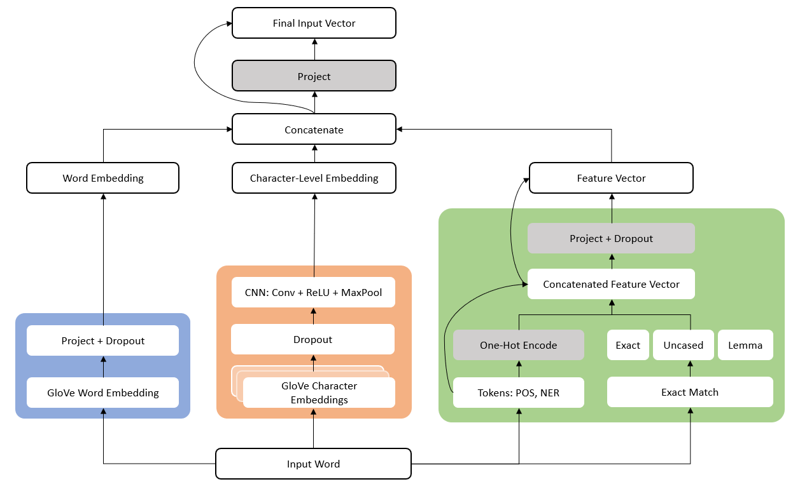

# squad_project

This is the code repository for the project _SQuAD 2.0: Improving Performance with
Optimization and Feature Engineering_ . Our paper can be found [in this repo](final_paper/final_paper.pdf) as well as on the CS 224N [Winter 2021 project webpage](http://web.stanford.edu/class/cs224n/reports/final_reports/report180.pdf)

## Project Overview
We set out to build a high-performing QA system for the Stanford Question Answering Dataset (SQuAD 2.0) without leveraging pretrained models. To this end, we augmented a __Bi-Directional Attention Flow__ (BiDAF) architecture to incorpoate character-level word embeddings, taking inspiration from the __DrQA__ model document reader. Our best model ensembled the top-seven highest-performing individual hyperparameter configurations; more details can be found in the paper. The encoding schema for our model is pictured below.




## Procedure
### 1. First Steps
The steps to set up the project environment and BiDAF baseline are found in `squad_setup.md`.

### 2. Generate features
After downloading the SQuAD dataset, we generate tagged features for the input data. Instructions are found in `setup_meta_feat.py` and
`integrate_meta_feat.py`.

### 3. Train the model
Details on the arguments available to our model are found in `args.py`. For example, to generate our best individual model, run:
```
source activate squad
python train.py -n best_model --use_char_embeddings True --use_exact cq --use_token cq --use_projection True
```
Using token input features will default to the files with these features generated in step 2. Other files can be specified using the appropriate args.

### 4. Test the model
To generate predictions for the held-out test SQuAD examples, run `test.py` by noting the appropriate `--split` (either `dev` or `test`) and by specifying the
model path with `--load_path`. Model args are the same as in step 3; the model will also default to the evaluation files generated with the necessary token inputs.

### 5. Ensembling
To ensemble models, see the code in `ensemble.py`.
